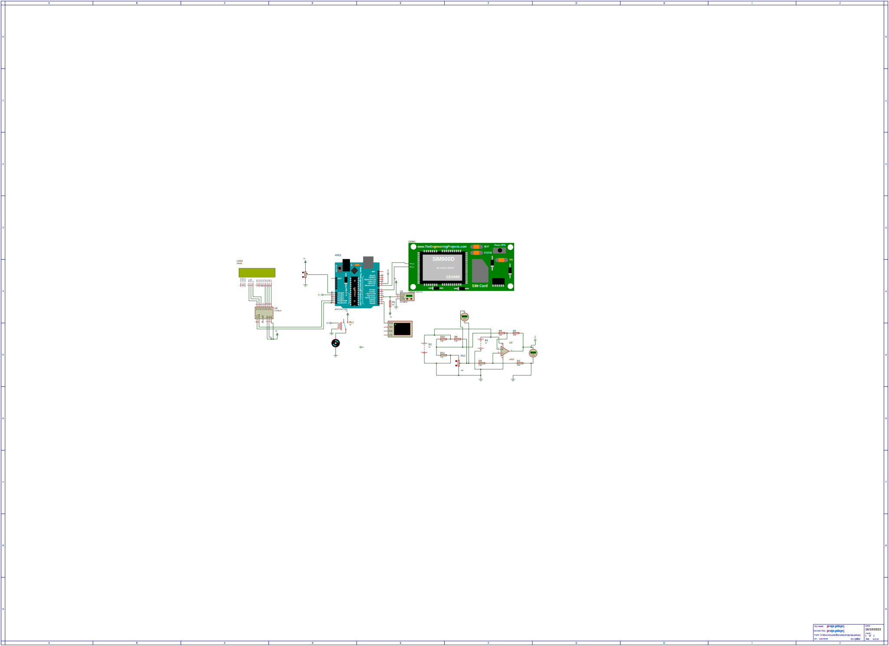

# Project: {Fuzzy-logic-with-arduino}
This project uses Fuzzy Logic to determine water quality using readings from a Turbidity sensor and Electrical conductivity sensor
## Step 1: Installation
This code has been run and tested on  Arduino IDE and Arduino Uno R3

Install the following libraries:

1. eFLL (Fuzzy logic library)
2. DFRobot_EC
3. One wire and Dallas temprature
4. LCD I2C library

## Step 2: Assemble the circuit
Here is a circuit on proteus

## Contributing
To contribute to this project please contact: ryankiprotich42@gmail.com

## Contributing
To contribute to this project please contact: ryankiprotich42@gmail.com
